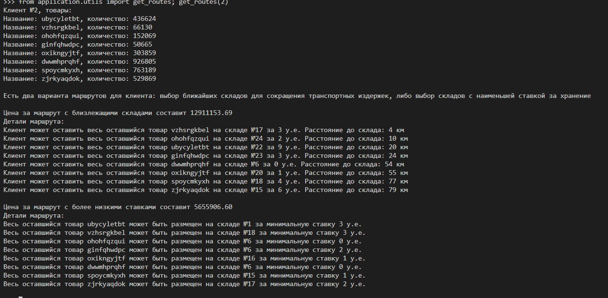
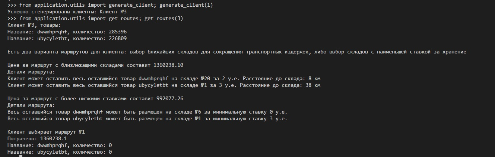

# warehouses_task

В соответствии с ТЗ, спроектированы модели Item, Warehouse, Client, а также вспомогательные модели для реализации связей Many-to-many.
В файле utils.py находятся функции:

* generate_items(amount) - генерирует желаемое количество товаров
* generate_warehouses(amount) - генерирует желаемое количество складов со случайным набором принимаемых товаров и случайными лимитами
* generate_client(amount) - генерирует желаемое количество пользователей со случайным набором и объемом товаров
* get_routes(client_id) - функция определяет оптимальные предложения с точки зрения транспортировки и хранения, выводит их в консоль, происходит выбор маршрута и результат сохраняется в БД

## Запуск

```
cd project
python manage.py makemigrations application
python manage.py migrate
python manage.py shell
```

Для тестирования маршрутов необходимо сгенерировать некое количество товаров, складов и клиентов в БД, а затем запускать функцию get_routes. Помимо вывода в консоли, можно отслеживать результаты работы в админке Django.

### Примеры вывода



